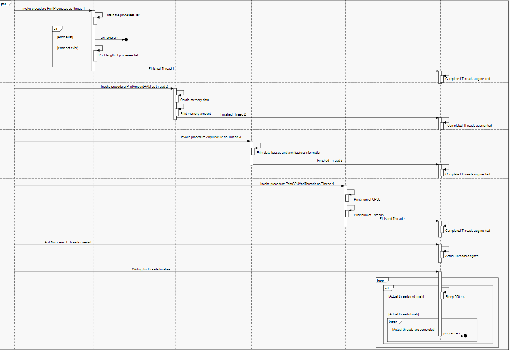

# Concurrent Task Manager 

## Descripción

El presente proyecto se nota como una solución computacional a la administración de los procesos y servicios del sistema operativo Windows en ambiente de consola. Este proyecto esta escrito en el lenguaje de programación Golang, esta decisión fue tomada por las características del propio aplicativo, pues, este requiere de planificación, estructuración y manejo de un flujo de hilos concurrentemente para lograr la mayor eficiencia posible.

Para lograr los objetivos ya presentados se hace uso de conceptos de PROGRAMACION CONCURRENTE y COMPUTACION CONCURRENTE, por lo que será necesario que, si se quiere analizar el comportamiento del programa desde su núcleo sintáctico y semántico (desde el código) se deberá tener en cuenta todo este conocimiento, por ello desglosaremos, brevemente, un tutorial con los conceptos necesarios para entender el programa.

## Tutorial

A continuación se  estudiara los conceptos respecto a la PROGRAMACION y COMPUTACION CONCURRENTE necesarios para poder analizar el programa aquí presentado.

### Hilos:

En computación los hilos son referencias de instrucciones encontradas en la memoria dinámica del computador.  

Si vemos a la memoria como una matriz de instrucciones:


El hilo seria, en esencia, cuando el computador hace referencia a un trozo de un conjunto de instrucciones y guarda esta referencia para ejecutarla mas tarde.

### Procesos y programas

Es importante, si se quiere entender los conceptos de la programación concurrente y asíncrona, hacer distinción entre los PROCESOS y los PROGRAMAS, los cuales pueden llegar a confundirse.

Cuando creamos nuestro programa escribimos un conjunto de instrucciones sobre un programa de edición de texto, hasta aquí esto es llamado PROGRAMA.
 
```go
 package main
 
import "fmt"

func  main() {

fmt.Println("Hello, World!")

} 
```


Cuando terminamos la codificación y programación el escrito deberá ser compilado y ejecutado, esto es un proceso o "un conjunto de instrucciones o programa en EJECUCION". 


## Explicación del proyecto

La solución consta de 4 módulos distintos que se comunican, estos módulos son:

 - Modulo de interfaz de usuario basada en terminal (TUI)
 - Modulo de manejo y sincronización de hilos.
 - Modulo de control de sistema operativo.
 - Modulo de miscalena o HELPERS para los demás módulos.

En esta sección solo se explicara el funcionamiento de los 3 últimos módulos.

### MODULO DE SINCRONIZACION Y MANEJO DE HILOS (threadtimesync)

Como hemos visto, los hilos son referencias en memoria, pero el objetivo que deseamos lograr con ellos es separar nuestro programa en distintos puntos de ejecución y correr estos puntos de manera sincronizada para ahorrar tiempo y aumentar la eficiencia de la solución, en esencia entonces, buscamos hacer existir varios procedimientos al mismo tiempo al momento de ejecutar; a esto se le llama EJECUCION SINCRONIZADA DE HILOS.
  
Para gestionar esta ejecución sincronizada se diseño este modulo, el cual se encarga de encolar los futuros hilos, manejar su creación, inserción y ejecución y manejar el tiempo de sincronización y espera de estos hilos.


### MODULO DE CONTROL DE SISTEMA OPERATIVO

Listara, manipulara, ejecutara, eliminara y realizara todos los procesos necesarios a nivel de sistema operativo para lograr los objetivos de la lógica del programa; este modulo se encargar, particularmente, de listar servicios y procesos del SO y de eliminar los que hagan falta.

### MODULO DE HELPERS

Procedimientos y funciones que, haciendo uso de los modelos diseñados y de la programación por referencias,  sirven la información que los demás módulos necesitan para funcionar, también sirve como intermediario entre módulos, es decir, permite la correcta comunicación entre módulos.


## Diagrama de ejemplo sobre funcionamiento de la sincronizacion de los hilos en el presente programa

Este diagrama fue realizado en base a la normalizacion UML como diagrama secuencial

